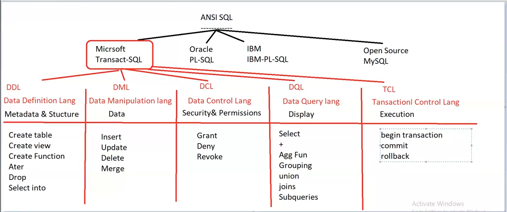

**ANSI:**

 هي library فيها كل ال queries بتاعه sql وابتدت كل شركه كبيره تستخدمها وتعدل عليها وتقسمها الي مجموعه من ال categories


### DDL:
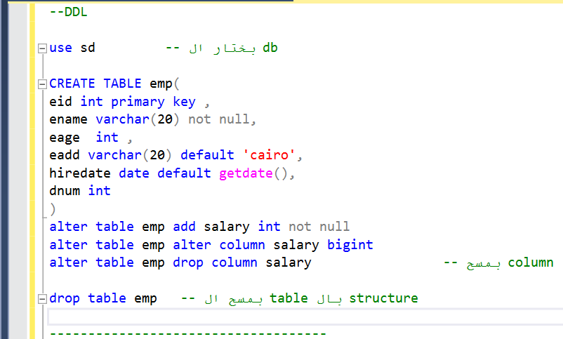

 create: create Table

alter:add, delete, or modify columns in an existing table
___
### DML:
**insert:**

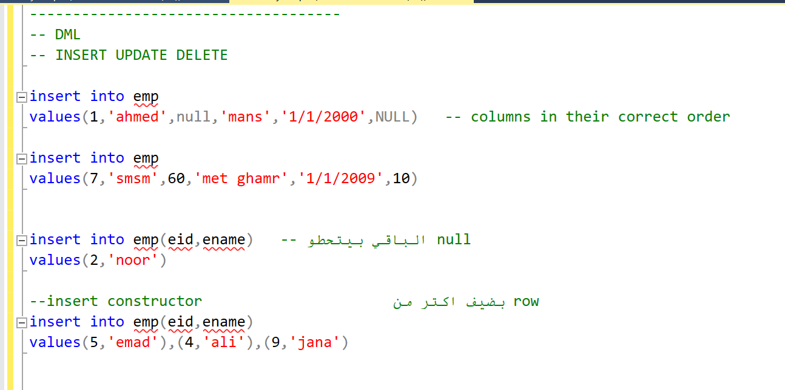


**update and delete:**
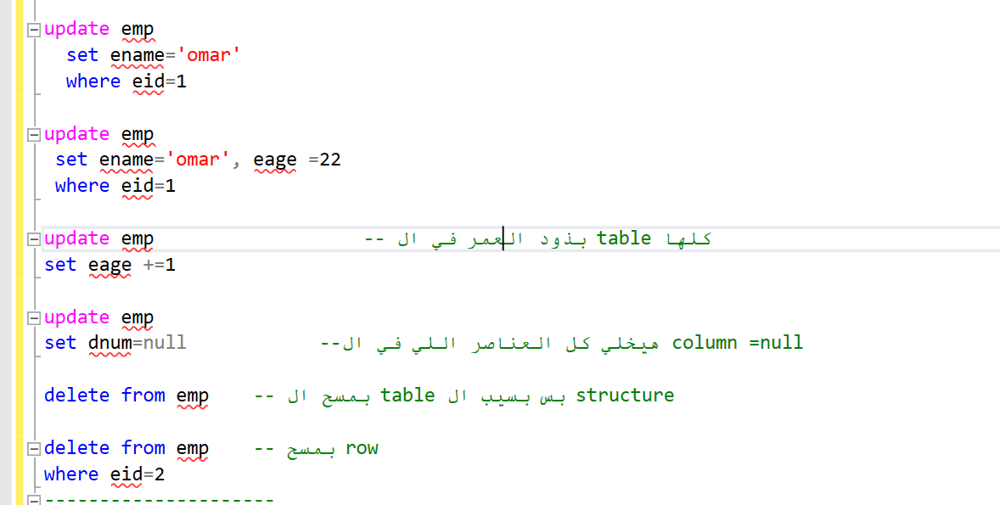
___
### DQL:
- select:
- 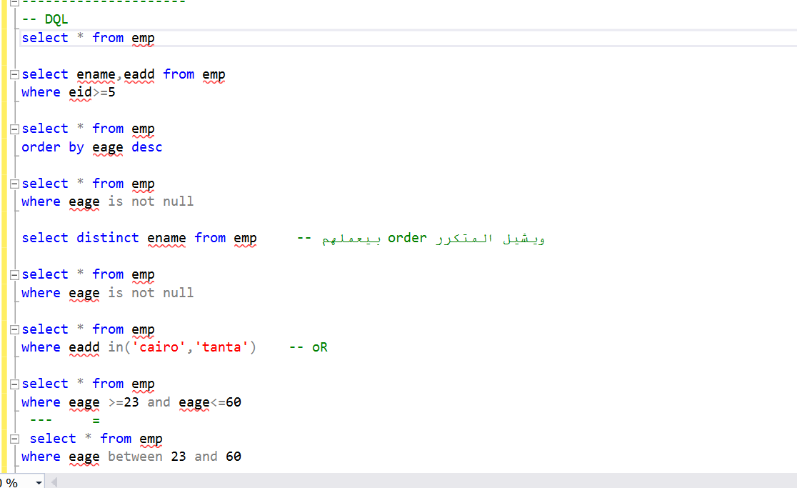

  ___
  ## Joins:
  
 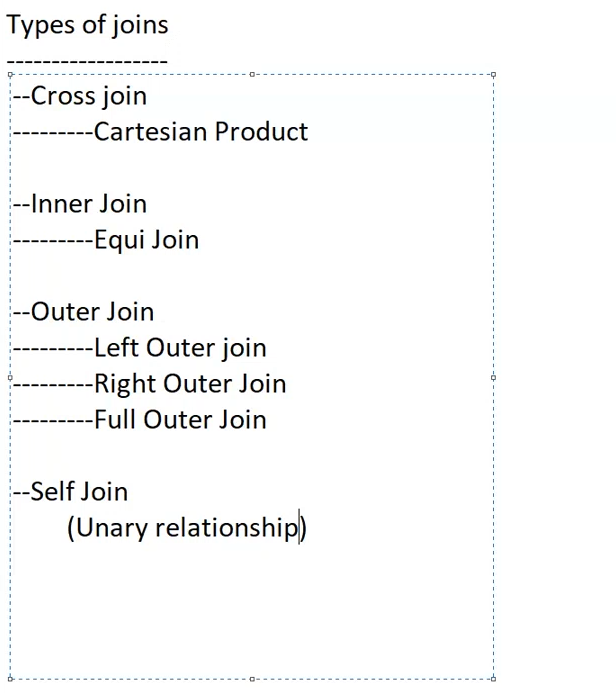

we will discuss these 2 tables:  
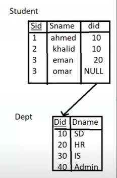

**cross join:**  
without where(condition)
```sql
selsect sname,dname
from student ,dept
```

**inner (Equi) join**  
there is where condition :match the primary key of one table  with the foreign key of the another table

```sql
selsect sname,dname
from student s ,dept d
where d.did=s.did
```
OR
```sql
selsect sname,dname
from student s inner join dept d
on d.did=s.did
```
**outer join:**
1.  left outer join: will get all the left rows with if it matches a value of the right table or not (is null)
   
     ```sql
        selsect sname,dname
        from student s left outer join dept d
        on d.did=s.did
      ```
2.   right outer join: will get all the right rows with if it matches a value of the left table or not (is null)
      ```sql
        selsect sname,dname
        from student s right outer join dept d
        on d.did=s.did
      ```
3.  full outer join: will get all the rows from left or right even if no matches (null)
     ```sql
        selsect sname,dname
        from student s full outer join dept d
        on d.did=s.did
      ```


**self join:**


- like employee and manager.
- the table which has the foreign key is>> the child ,is existed in the database>>employee
- the copied table is the parent , is stored in the memory only >>manager
    ```sql
        selsect x.ename as empname ,y.ename as mgname
        from employee x ,employee y
        on y.eid=x.superid
    ```

  
**join multiple tables**

لو مفيش علاقه تربط جدولين ببعض وانا عايز داتا من الجدولين
- we must use bridge table  
- conditions=tables-1
    ```sql
        select Fname,Pname
        from Employee E,Project P,Works_for W
        where e.SSN=w.ESSn and p.Pnumber=w.Pno
    ```
OR

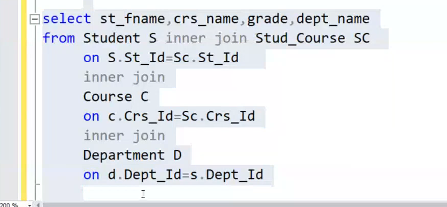


**join ,DMl**
**join ,Update**

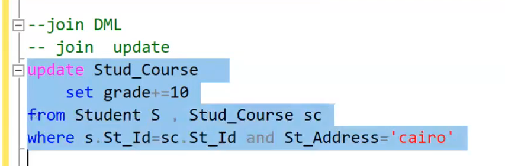

note:      
 join   بعمل  
 
 لو انا عايز بيانات موجوده في جدول بمعلوميه بيانات موجوده في جدول تاني

 زي اعرضلي درجات الطلاب (موجوده في COURSE ) اللي عايشه في القاهره (موجوده في student)


**some built in functions**    
`how to exchange the null value:`
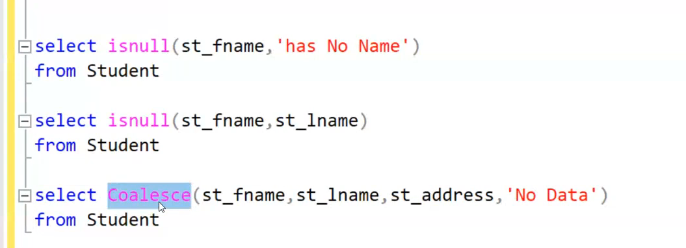
- null take one replacment     
-  Coalesce take multiple replacement     
   exchange Null value with any avilable data

``` sql
select substring (stu_fname,1,3)
from student 

```


`to combine two columns using contact fun`
- turn any column to string data type to concat between them
- replace any NULL value with empty string
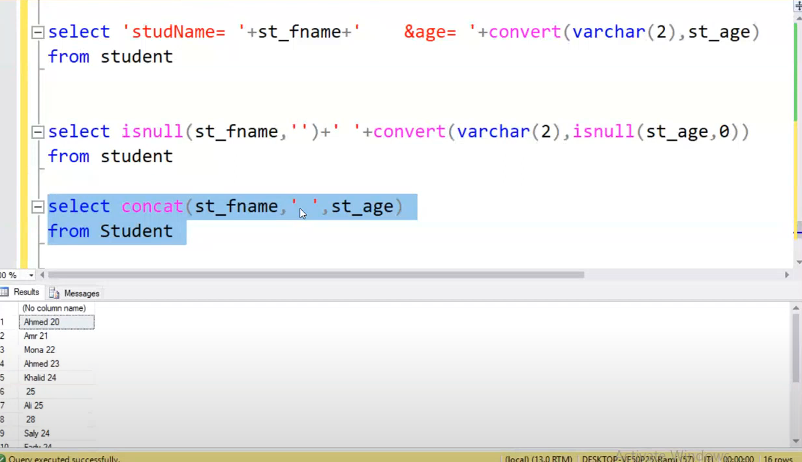


 **like**: 
  as '=' ,its appended to:
    - ***_:*** one character
    - ***%:*** zero or more characters

```sql
        select *
        from student s
        where s.name like '_a%'
 ```
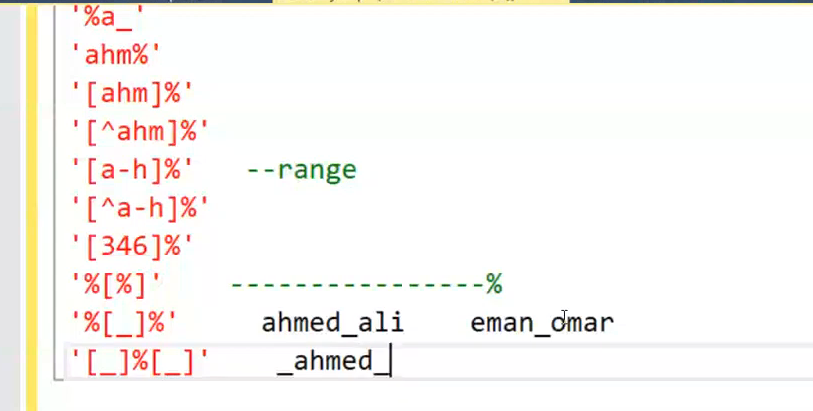


**order:**

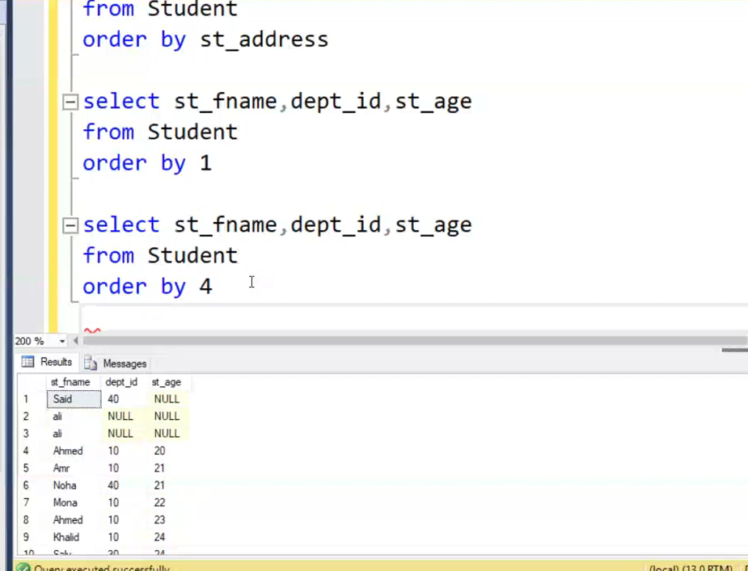
___
## normalization :
i wrote an article about it before:
[normalization](https://medium.com/@a7medelgaml11a/functional-dependencies-normalization-088215f56dd5)

### two examples:
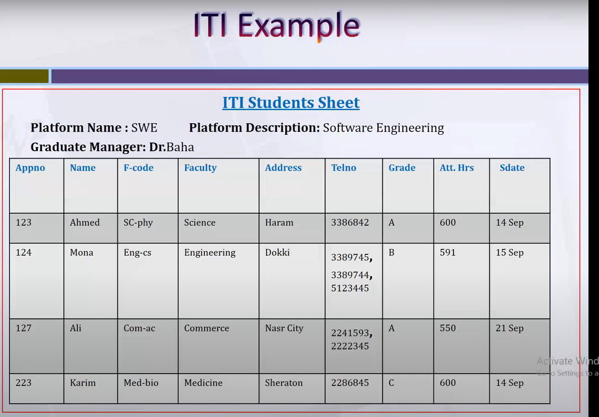
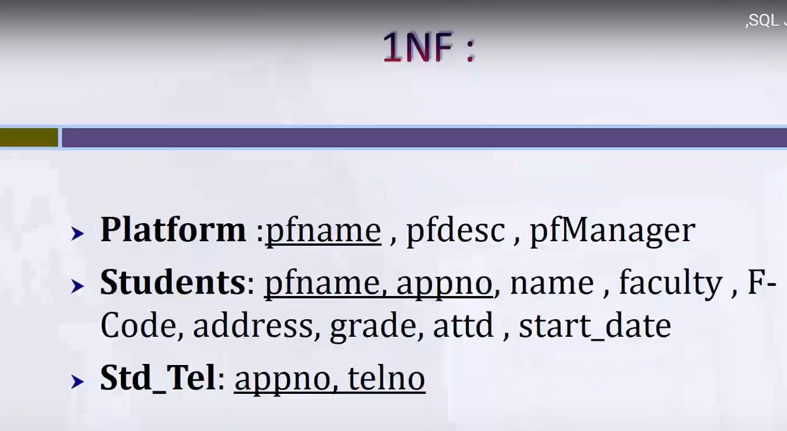

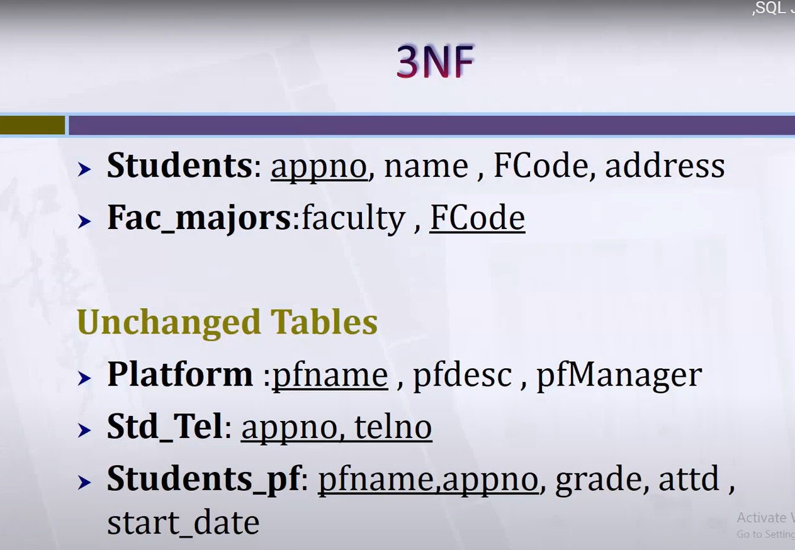
___
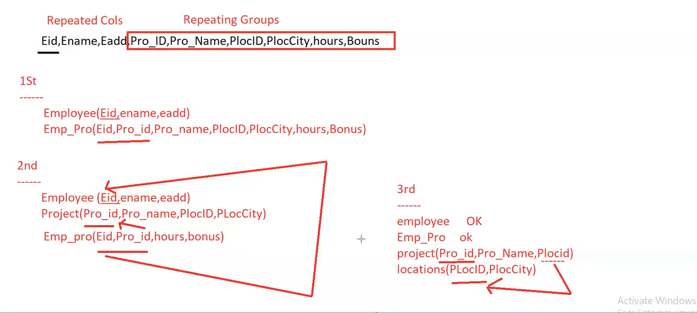

___
____
____
___
### aggregate function:
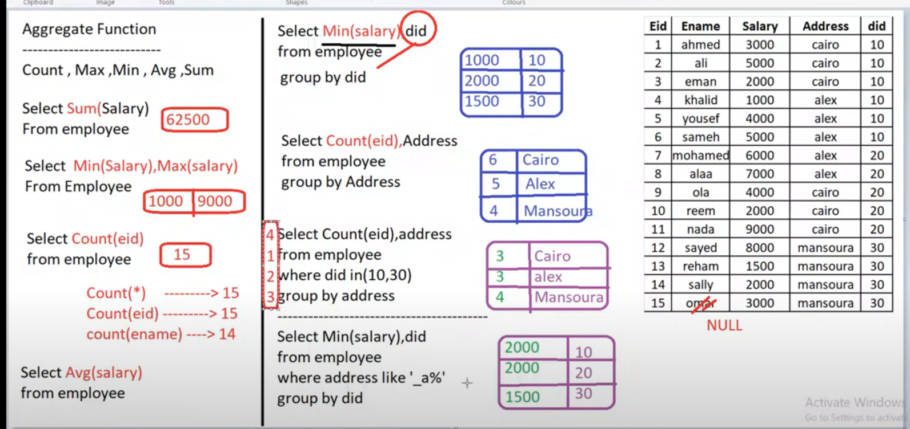


**notes:** 

- لو معايا agg fun ,  او اكتر column  > يبقي لازم اعمل grouping علي ال columns دي


- agg fun + column = agg feun for each column    

- ال agg funs مبتحسبش ال null values


- مبعملش group by ولا بال pk ولا ب * عشان دي معناها  (sum,avg,min) for each row  فكدا ملهاش معني 


`where :`      

بتاثر علي ال rows بس فبتغير ال values انما مش بتشيل group بالكامل>>>(**select row**)      


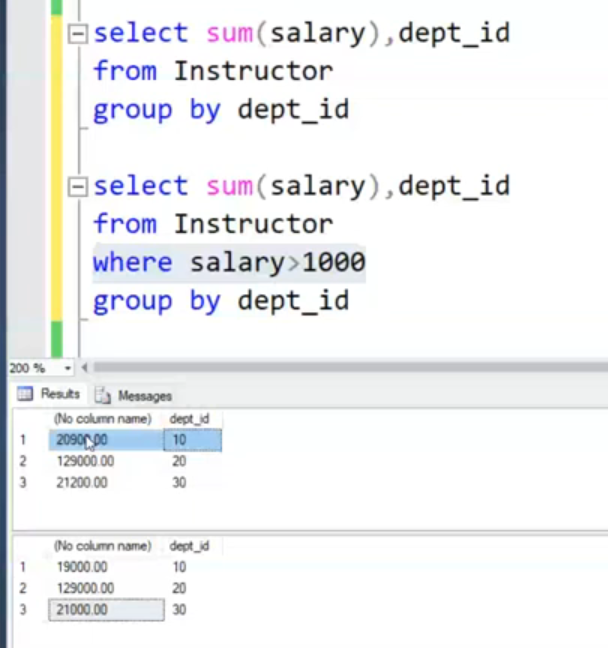


`having:`     
select group, بتشيل group 


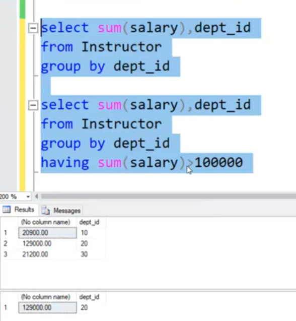


- ال  having دايما بتيجي مع ال agg fun بعد ال group

- ال select اخر حاجه في ال query     
ال where ثم ال group ثم ال having    
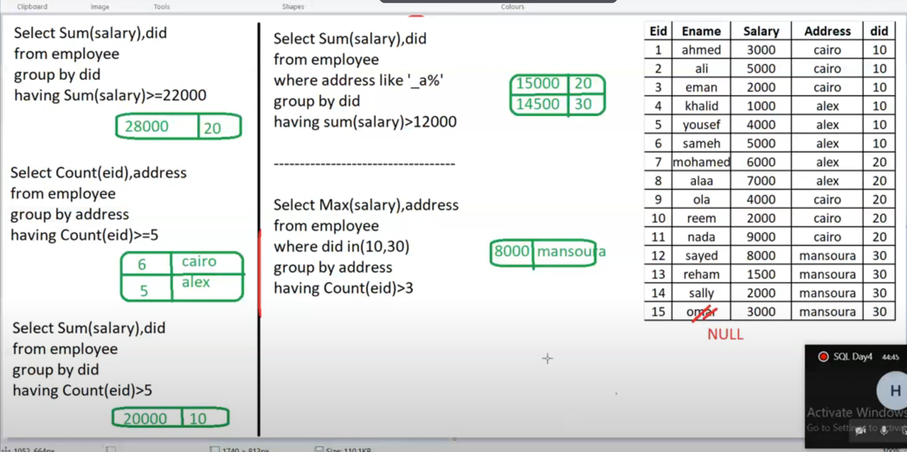

EX:

عايز داتا من اكتر من table فعملت join    
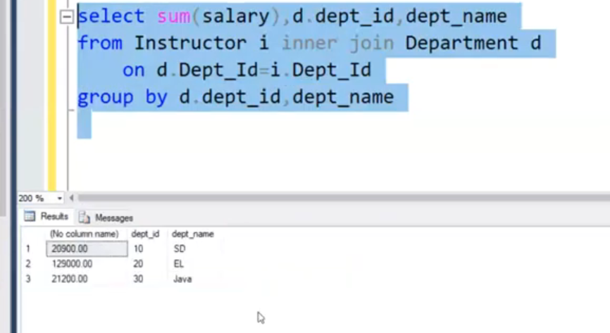

معناها for each dep id for each address     
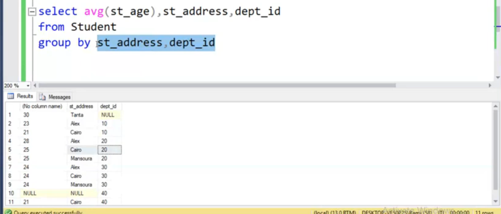


___
subqueries:     
  اخر حاجه افكر فيها عشان بطيئه    

- باخد ال output بتاع query ك input ل query تانيه 

- ال inner query بتتنفذ الاول
``` sql
select * 
from student
where st_age<select avg(st_age) from student 
=
select * 
from student
where st_age<23
```

- ممكن اعمل inner query علي table تاني غير اللي في ال outer query

``` sql
select dept_name
from department 
where dept_id in (select dept_id from student where dept_id is not null)

دا بيجبلي اسامي الاقسام اللي فيها طلبه وكان ممكن تتعمل ب join وكانت هتبقي احسن

select dept_name
from department d ,student s
where d.dept_id=s.dept_id
```
**subquery + dml**
``` sql
امسح من جدول المقررات الطلبه اللي عايشين في القاهره (من جدولين مختلفين)
delete from stu_course
where stu_id in (select stu_id from student where stu_address ='cairo' )

```
___
**union family:**

`union all:`

بيحط 2 queries ملهمش علاقه ببعض . مع بعض

لازم عدد ال columns في ال select الاولي اد عدد ال columns في ال select التانيه وكمان نفس ال datatype
-  union gets only the distinct values
``` sql
select st_name
from Students
union all
select ins_name
from Instructors

```

`union:`      
بترتب وتشيل المتكرر

'بتطلع ال unique'
- union gets only the distinct values

``` sql
select st_name
from Students
union 
select ins_name
from Instructors

```


`intersect:`         
هات المتقاطع بس من الجدولبن

بترتب وتشيل المتكرر

``` sql
select st_name
from Students
intersect 
select ins_name
from Instructors

```


`except:`     
 هات الموجوده في الاولي ومش موجوده في التانيه

بترتب وتشيل المتكرر

``` sql
select st_name
from Students
except 
select ins_name
from Instructors

```


note:
 
 لو مطلوب delet او update شيئ معين والشيئ دا ليه علاقات مع tables تانيه )(موجود في tables تانيه) يبقي لازم اطبق ال qureies دي علي ال tables التانيه لحد اما الشخص دا يختفي من ال tables التانيه وبعد كدا اطبق ال query الاصليه بتاعتي

 ___
 ___
 ___
 ## sql server :  

 هو مقسم لكذا تصنيف من ميكروسوفت مش بس عشان اكتب query 

 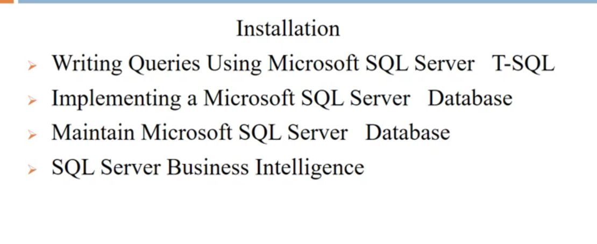

 وهنتكلم دلوقتي عن ال implementation
  

ميكروسوفت كانت بتنزل versions من sql server وليها features معينه اما ال edditions هي features مقابل فلوس  
 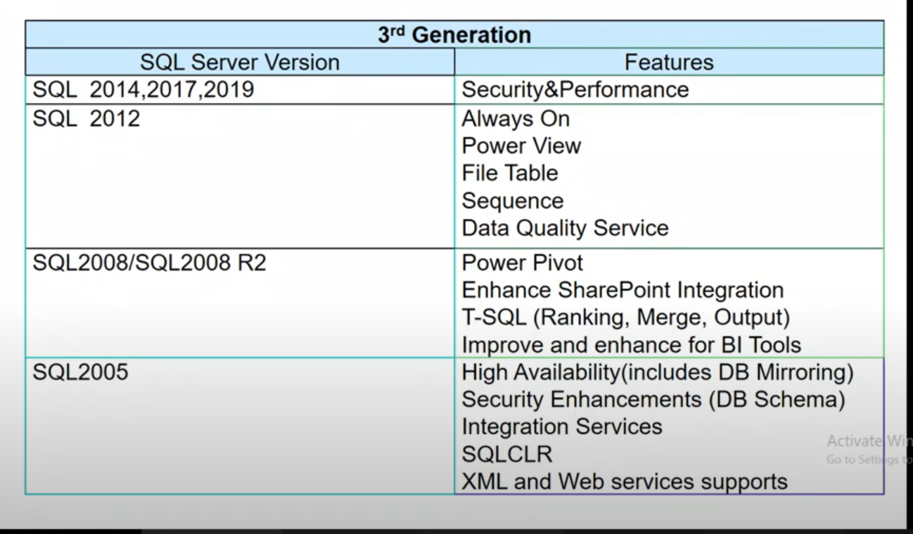
 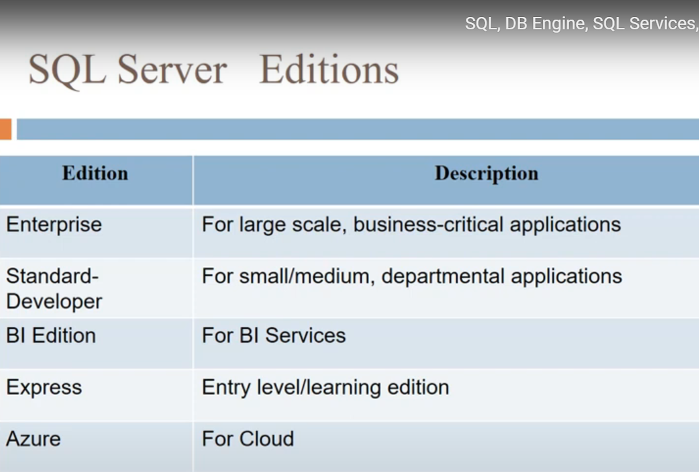

 الcloud وفرت عليا اني احمل الsql server بحيث انه متحمل جاهز علي الكلاود وما عليا غير اني اعمل اكونت عليه واتعامل معاه بقي وابعتله الداتا بيز بتاعتي 

`sql is fully RDBMS`

 علم قواعد البياتات مما يحتويه من security,joins,performance,bi,analisis...
 ال tool اللي عرفت تعمل implementation لكل دا هي sql server

 `the tables in SQL SERVER have 1 to many relations`

 ___
## الجاجات اللي بتقابلني لما اجي اعمل set up to sql server
 لما بحمل sql server انا بنزل instance:

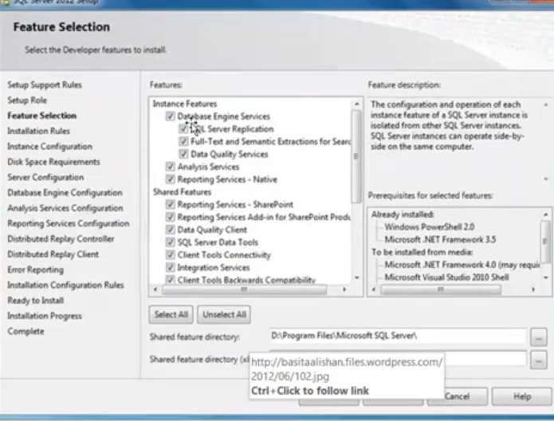

ال dbms هو اللي اقدر من خلاله ا connect علي كذا service

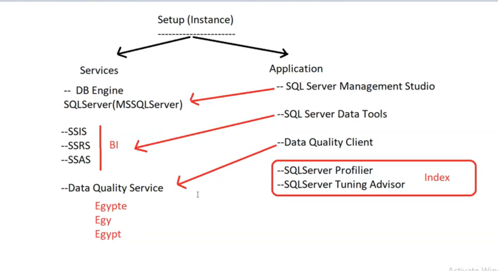

 **ممكن احمل DB ENGINE اكتر من مره ليه؟**

لو عند مثلا 20  db وكل واحده بيconnect عليها users كتر ف ممكن اقسمهم علي 2 db engine عشان اوفر في ال memory وال processor كأن عندي 2 servers     
اول مره بيبقي default instance بعد كدا ببقي named instancies ممكن ا connect عليهم كلهم من خلال ال DBMS

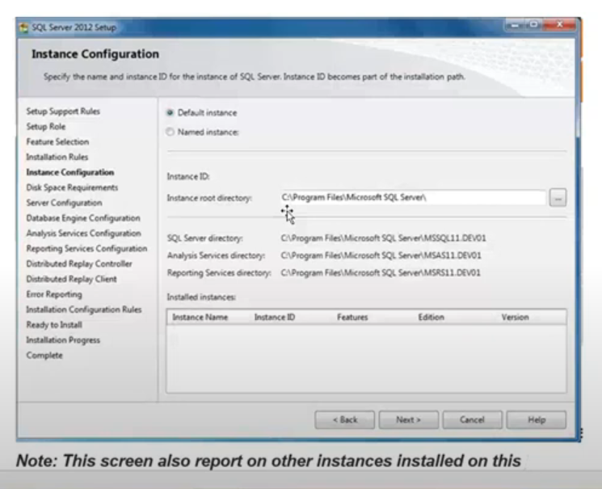

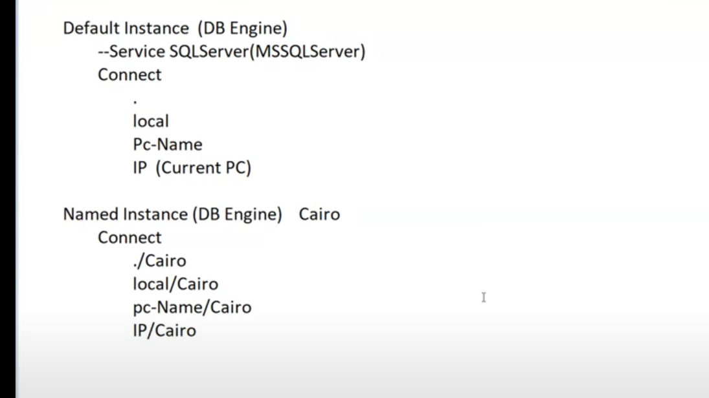
___

**security:**

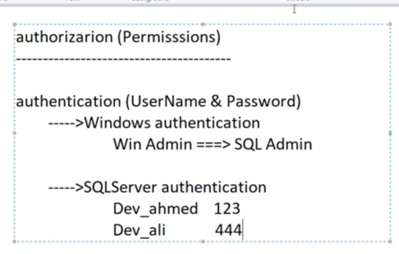


to allow remotly connecting on the server >> 

لازم اتاكد ان المود بتاع ال authentication>>  (sql server and windwos)

(مش بس للي دخل علي ال windows عشان مينفعش ادخل حد علي ال windwos بتاعي)
- ssql server,right click,properties,security>> (sql server and windwos)
- right clic,restart
- security,login , right click,new login
    - 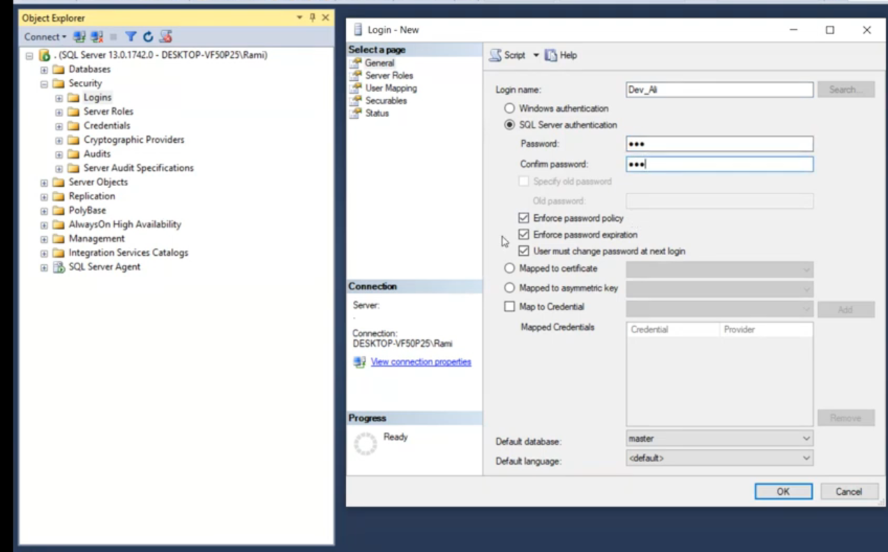
  
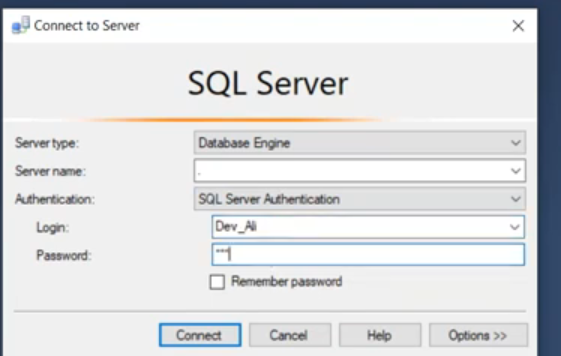   

واكتب في ال server name ال ip بتاع ال  servere

هو كدا دخل علي ال server بس ميعرفش يشوف اي داتا بيز فلازم احوله من login الي user:

 لكل db فولدر اسمه security            

 جواه فودلر user ,right clic,new user
  
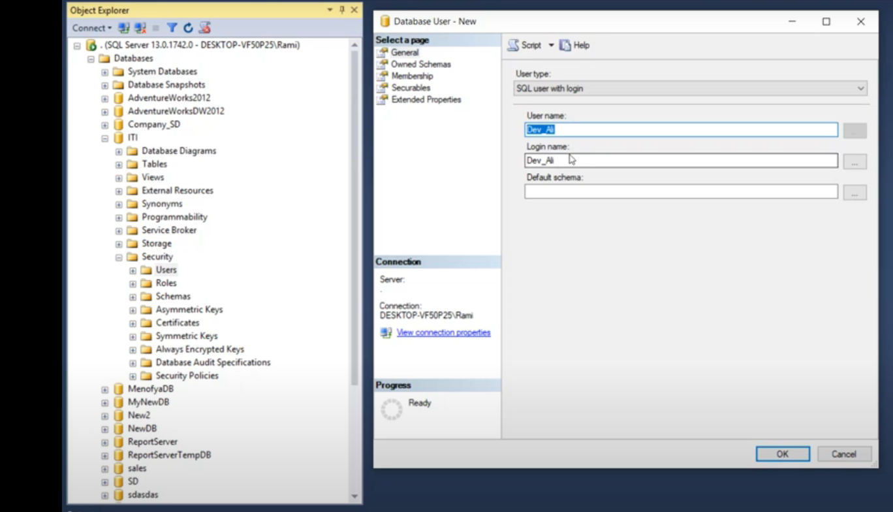   

وبكدا ال db adminstrator يقدر يعمل لكل developer :  
 user علشان يقدر يدحل علي السيرفر
___
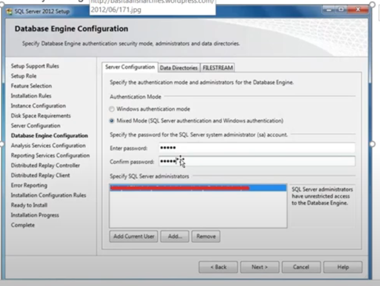   

- لو انا اختارت windwos authentication انا كدا عندي ادمن واحد اللي هو ال windwos اللي عليه ال server ومنعت ال remote connection
-  لو انا اختارت (sql server and windwos authentication) كدا انا عملت allow to remote connection وكمان بقي عندي 2 admins :
 1. ال admin بتاع الوندوز اللي انا ب connect بيه لما اقعد علي الجهاز اللي عليه ال service,
 2. و admin user :sa 
__________________________________________
## queries:    
`top`:      تستخدم لعرض اول صف         
:لعرض اكبر 3 مرتبات
```sql
select top(3) salary 
from instructor
order by desc
```

`with ties:`

بترجع الجداول المطلوبه + الجداول اللي ليها نفس قيمه اخر صف

ex:         
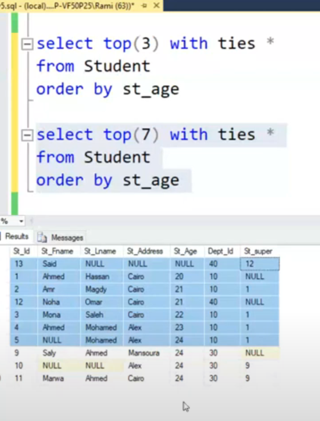   


`select new_id() `       

- بتجيب unique id عليي مستوي ال server كله   

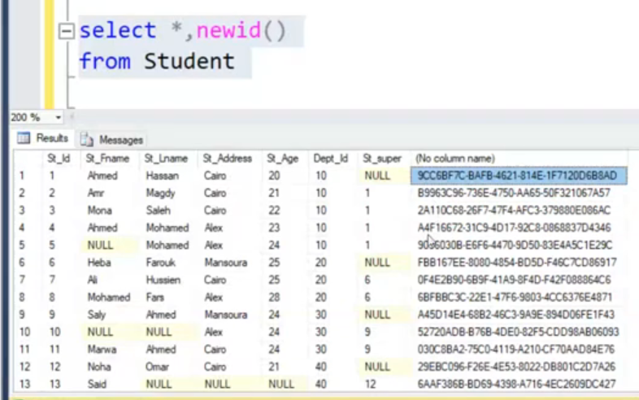   

- بتستخدم لعمل randomize to the data   

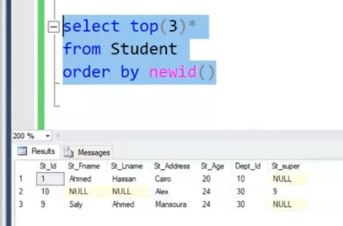   


`excution order:`
1. from
2. join 
3. on 
4. where 
5. group
6. having
7. select
8. order by
9. top


### مينفعش اعمل  where علي elias name موجود في ال select  عشان ال where بتتنفذ قبل ال select عشان كدا مش هلاقيه عندي اصلا بس ينفع اعمل بيه order عادي

ex:                        
``` sql
select fname_+' '+lname as [ fullname ]
from student 
where fullname  =    
XXXXXXXXXXXXXX
```
``` sql
select fname_+' '+lname as [ fullname ]
from student 
order by fullname   
✔✔✔✔✔✔✔✔✔✔✔
```

### طب احلها ازاي؟؟
1. عادي :            
``` sql
select fname_+' '+lname as [ fullname ]
from student 
where fname_+' '+lname  =    
```


2. subquery:          
   as new table
``` sql
select * 
from(
   select fname_+' '+lname as [ fullname ]
   from student) as new table
where fullname  = 'ahmed ali'
```
___
`objects and default path:`         

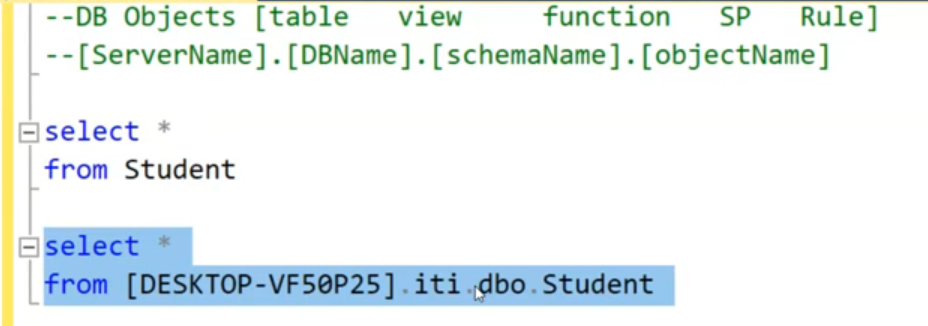   


### بتفيدني في ايه؟
- ممكن اعمل select ل table موجود في داتابيز تانيه غير اللي انا عاملها use:
``` sql
select *
from company_sd.dbo.project 
```

- وممكن اعمل join او union to 2 tables كل table موجوده في داتابيز مختلفه او علي سيرفرين مختلفين كمان
``` sql
select d_name
from company_sd.dbo.project 
union all 
select dname
from department 
```


`DDL:`

ممكن اعمل table بدلاله table تاني يعني بعمل جدول جديد وبحط فيه كل الداتا كل جدول تاني
``` sql
select * into table1
from student
```

وممكن اعمل table في داتا بيز تانيه من خلال ال path
``` sql
select * into company_sd.dbo.student
from student
```

وممكن اعمل جدول ا حط فيه حاجات معينه من جدول تاني
``` sql
select fname,lname into table2
from student
where address='mansoura'
```


ممكن اعمل table فاضي يعني اخد ال table copy paste بس من غير داتا يعني اخد ال structure بس 
عن طريق اني احط invalid condition          
كاني عملت script: كود للاستراكشر من غير داتا         
table,rightclick,script table as,create to,new query

``` sql
select * into table1
from student
where 1=2
```


وممكن اخد داتا من table احطها في table تانيه          
insert based on select           
``` sql
insert into table3
select fname 
from student
لازم يكون ال table اللي بتعمله insert موجود ومفهوش غير ال columns اللي انت هتضفها
```

ممكن اعمل having من غير group by لو ال select فيهاا agg fun بس من غير column
كان ال table is one group وبعمل عليه having
``` sql
select max (salary)
from instructor
having count(id)>10
```


___
`ranking function:`      
special built in functions    

####  في اسئله مبعرفش ارد عليها زي 

- هاتلي بياتات تالت salary    

- او اعلي 2 salaries مع التكرار (ممكن يبقي في 10 اشخاص بيقبضو زي بعض)  

- او قسملي 10 موظفين علي 3 groups مثلا وهنا دايما الناقص بيبقي في اخر droup يس مينقصش اقل من 1 يعني 13 موظف علي 3 اقسمام هتبقي 5و4و4


### ranking function:        
 **هي functions بتحط ارقام في ال table وكل واحده ليها algorithm بتحط بيه الارقام فانا عايز اعمل where condition علي الارقام دي عشان اجاوب علي ال 
business اللي اتكلمت عنها دلوقتي 
وعلشان هي elias name في ال select مينفعش اعمل عليها where فحطتها في subquery as an inner**

    

RN = 3  ??  تالت اعلي موظف     
DR<=2    ?? اعلي مرتبين مع التكرار
g=1    ??          اول group 


`Row_number`          

بترتبهم بالترتيب الصحيح علشان اعرف اجاوب علي الاسئله النتعلقه بالترتيب    

هاتلي بيانات اكبر موظف 

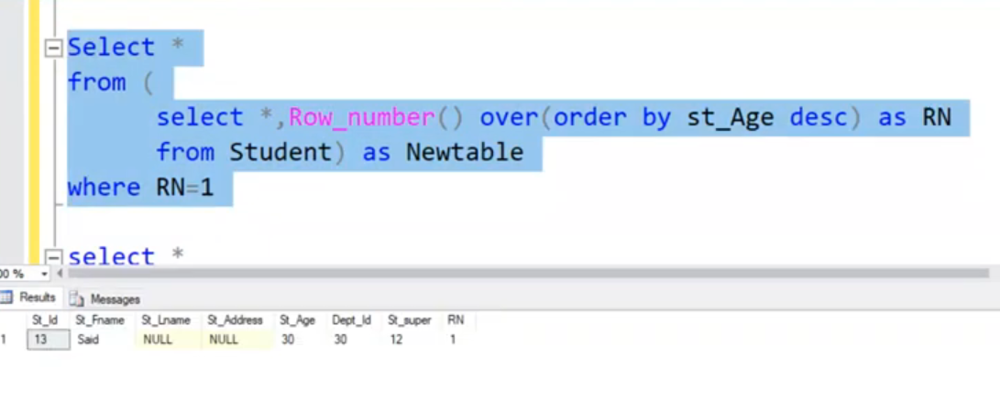    


`Dense_Rank:`       

هاتلي بيانات اكبر موظف مع التكرار     
طلع في اتنين ليهم نفس العمر 

    


`NTile`

هي اللي بتقسمهم الي groups وكل group بياخد نفس الرقم   

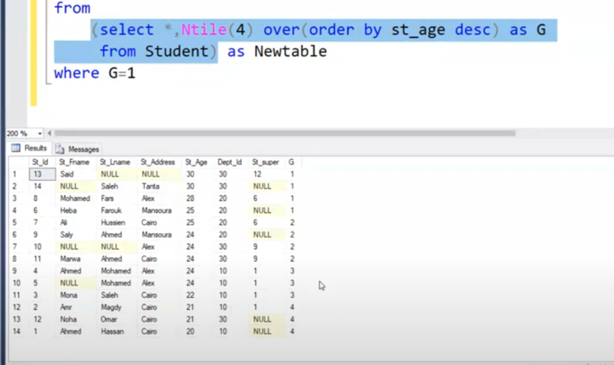  

هاتلي اول group 


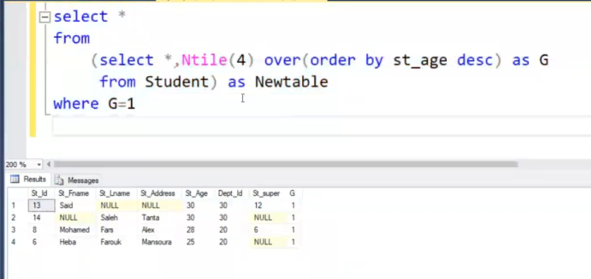    


`rank function`  **self study**:

تقوم بترتيب الصفوف علي حسب قيمه معينه ولو اكتر من صف ليهم نفس القيمه بتاخد نفس الترتيب ويتم تخطي الترتيب دا يعني 1 1 3 3 3 6 
 بتفيدني في تقديم البيانات بطريقه مفيده ومرتبه و حساب المتوسط أو القيمة القياسية للصفوف التي تحتل مرتبة معينه

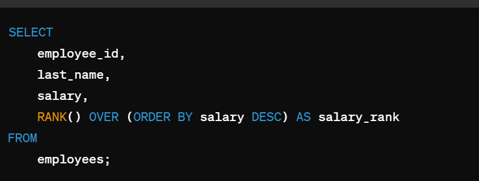    

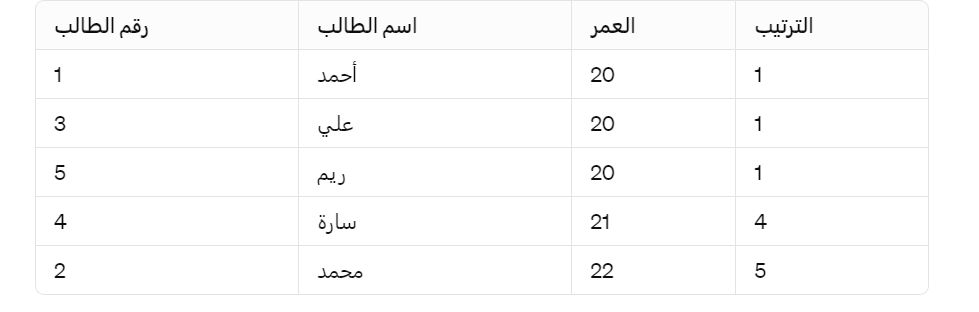    


`partition:`

بتقسم ال rows الي groups زي group by من غير متخفي ال rows وبعدها ابدا ارتب كل group لوحده

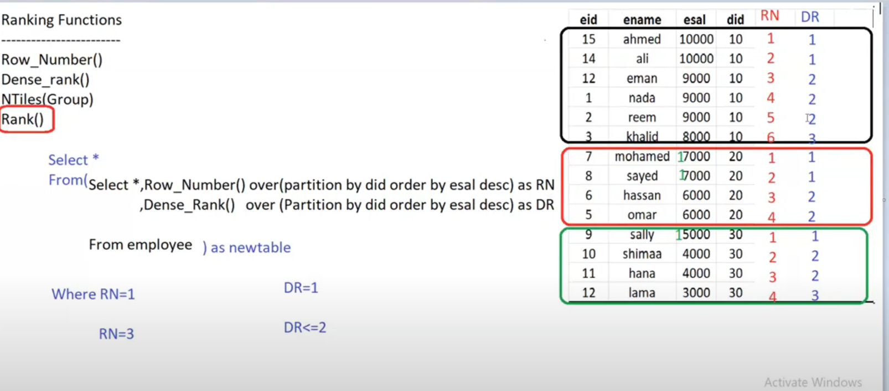    
كل اللي ليهم  id في group
     
RN = 1  ??  بيانات اعلي موظف قي كل قسم     
RN = 3  ??  بيانات تالت اعلي موظف قي كل قسم     
DR<=2    ?? اعلي مرتبين في كل قسم مع التكرار


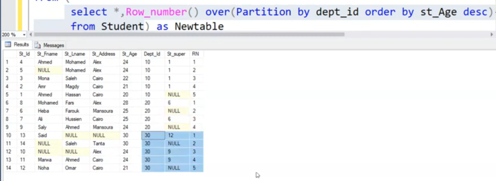  

هات اكبر موظف في كل قسم

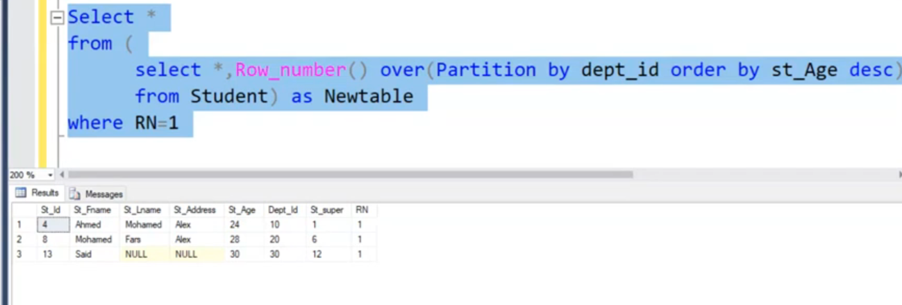  

مع التكرار

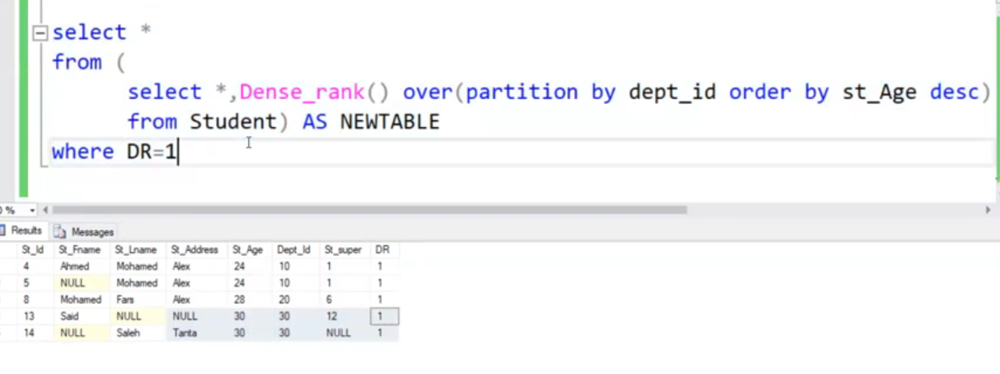  


___
DATA TYPES:


___
keywords and built in funs

case:

  with select:


 with update:

لو كانت if , else بس ممكن استخدم iif


___
بيحولو من data tybe ل datatybe
convert:       
cast:


format :   لو اديتها تاريخ بتحولو لوحدها الي string
yyyy
2:2/4/2024       
4:monday novamber 2020
3:mon nov 2020
hh:12       
HH:24          
tt:pm,am

photo:الاولي بترجعها ك string التانيه بترجعها ك int فعلي حسب هتدخلها في ايه

eomontht(getdate())    31.1.2024
بترجع اخر يوم في الشهر

select format (eomontht(getdate()),'dd')    31