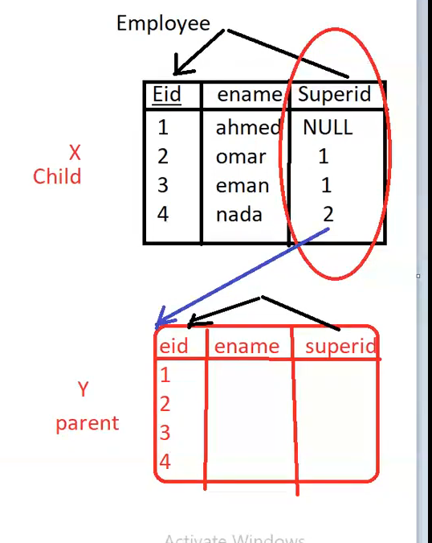
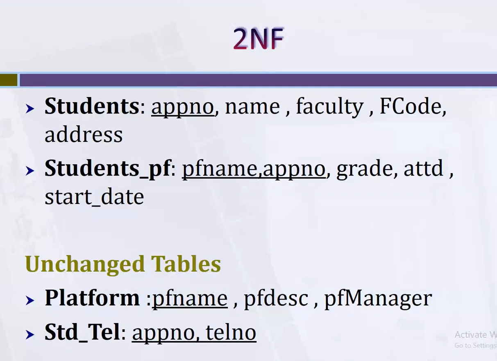

**ANSI:**

 هي library فيها كل ال queries بتاعه sql وابتدت كل شركه كبيره تستخدمها وتعدل عليها وتقسمها الي مجموعه من ال categories


### DDL:


 create: create Table

alter:add, delete, or modify columns in an existing table
___
### DML:
**insert:**


**update and delete:**

___
### DQL:
- select:
- 

  ___
  ## Joins:
  
 

we will discuss these 2 tables:  


**cross join:**  
without where(condition)
```sql
selsect sname,dname
from student ,dept
```

**inner (Equi) join**  
there is where condition :match the primary key of one table  with the foreign key of the another table

```sql
selsect sname,dname
from student s ,dept d
where d.did=s.did
```
OR
```sql
selsect sname,dname
from student s inner join dept d
on d.did=s.did
```
**outer join:**
1.  left outer join: will get all the left rows with if it matches a value of the right table or not (is null)
   
     ```sql
        selsect sname,dname
        from student s left outer join dept d
        on d.did=s.did
      ```
2.   right outer join: will get all the right rows with if it matches a value of the left table or not (is null)
      ```sql
        selsect sname,dname
        from student s right outer join dept d
        on d.did=s.did
      ```
3.  full outer join: will get all the rows from left or right even if no matches (null)
     ```sql
        selsect sname,dname
        from student s full outer join dept d
        on d.did=s.did
      ```


**self join:**




- like employee and manager.
- the table which has the foreign key is>> the child ,is existed in the database>>employee
- the copied table is the parent , is stored in the memory only >>manager
    ```sql
        selsect x.ename as empname ,y.ename as mgname
        from employee x ,employee y
        on y.eid=x.superid
    ```

  
**join multiple tables**

لو مفيش علاقه تربط جدولين ببعض وانا عايز داتا من الجدولين
- we must use bridge table  
- conditions=tables-1
    ```sql
        select Fname,Pname
        from Employee E,Project P,Works_for W
        where e.SSN=w.ESSn and p.Pnumber=w.Pno
    ```
OR


**join ,DMl**
**join ,Update**


note:      
 join   بعمل  
 
 لو انا عايز بيانات موجوده في جدول بمعلوميه بيانات موجوده في جدول تاني

 زي اعرضلي درجات الطلاب (موجوده في COURSE ) اللي عايشه في القاهره (موجوده في student)


**some built in functions**    
`how to exchange the null value:`

- null take one replacment     
-  Coalesce take multiple replacement     
   exchange Null value with any avilable data

``` sql
select substring (stu_fname,1,3)
from student 

```


`to combine two columns using contact fun`
- turn any column to string data type to concat between them
- replace any NULL value with empty string


 **like**: 
  as '=' ,its appended to:
    - ***_:*** one character
    - ***%:*** zero or more characters

```sql
        select *
        from student s
        where s.name like '_a%'
 ```


**order:**


___
## normalization :
i wrote an article about it before:
[normalization](https://medium.com/@a7medelgaml11a/functional-dependencies-normalization-088215f56dd5)

### two examples:




___


___
____
____
___
### aggregate function:


**notes:** 

- لو معايا agg fun ,  او اكتر column  > يبقي لازم اعمل grouping علي ال columns دي


- agg fun + column = agg feun for each column    

- ال agg funs مبتحسبش ال null values


- مبعملش group by ولا بال pk ولا ب * عشان دي معناها  (sum,avg,min) for each row  فكدا ملهاش معني 


`where :`      

بتاثر علي ال rows بس فبتغير ال values انما مش بتشيل group بالكامل>>>(**select row**)      


`having:`     
select group, بتشيل group 


- ال  having دايما بتيجي مع ال agg fun بعد ال group

- ال select اخر حاجه في ال query     
ال where ثم ال group ثم ال having    


EX:

عايز داتا من اكتر من table فعملت join    


معناها for each dep id for each address     


___
subqueries:     
  اخر حاجه افكر فيها عشان بطيئه    

- باخد ال output بتاع query ك input ل query تانيه 

- ال inner query بتتنفذ الاول
``` sql
select * 
from student
where st_age<select avg(st_age) from student 
=
select * 
from student
where st_age<23
```

- ممكن اعمل inner query علي table تاني غير اللي في ال outer query

``` sql
select dept_name
from department 
where dept_id in (select dept_id from student where dept_id is not null)

دا بيجبلي اسامي الاقسام اللي فيها طلبه وكان ممكن تتعمل ب join وكانت هتبقي احسن

select dept_name
from department d ,student s
where d.dept_id=s.dept_id
```
**subquery + dml**
``` sql
امسح من جدول المقررات الطلبه اللي عايشين في القاهره (من جدولين مختلفين)
delete from stu_course
where stu_id in (select stu_id from student where stu_address ='cairo' )

```
___
**union family:**

`union all:`

بيحط 2 queries ملهمش علاقه ببعض . مع بعض

لازم عدد ال columns في ال select الاولي اد عدد ال columns في ال select التانيه وكمان نفس ال datatype
-  union gets only the distinct values
``` sql
select st_name
from Students
union all
select ins_name
from Instructors

```

`union:`      
بترتب وتشيل المتكرر

'بتطلع ال unique'
- union gets only the distinct values

``` sql
select st_name
from Students
union 
select ins_name
from Instructors

```


`intersect:`         
هات المتقاطع بس من الجدولبن

بترتب وتشيل المتكرر

``` sql
select st_name
from Students
intersect 
select ins_name
from Instructors

```


`except:`     
 هات الموجوده في الاولي ومش موجوده في التانيه

بترتب وتشيل المتكرر

``` sql
select st_name
from Students
except 
select ins_name
from Instructors

```


note:
 
 لو مطلوب delet او update شيئ معين والشيئ دا ليه علاقات مع tables تانيه )(موجود في tables تانيه) يبقي لازم اطبق ال qureies دي علي ال tables التانيه لحد اما الشخص دا يختفي من ال tables التانيه وبعد كدا اطبق ال query الاصليه بتاعتي