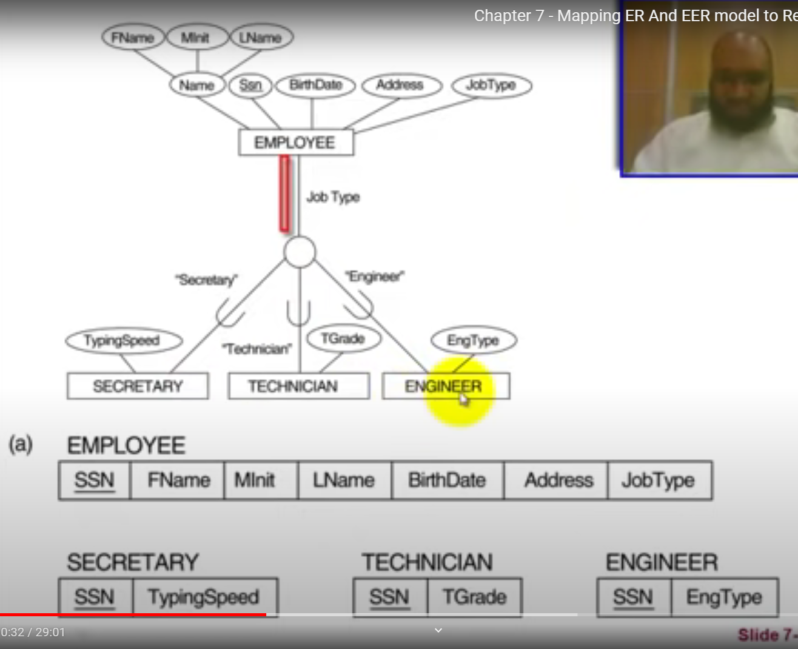

 # ch 7 >> Mapping ER And EER Model
 
  ## طب ازاي احول الERD الي SCHEMA

1.  بعمل لكل entity جدول
1.  بعمل لكل  multivalued attribute جدول وبحط فيه ال key attribute بتاع ال entity الرئيسي ويبقي هم الاتنين primary key
1.  بعمل لكل علاقه M:N جدول وبحط فيه ال pk بتاع الاتنين entities بتوعها واي attribute موجود علي العلاقه
2.  لكل علاقه  M:1 بنقل ال PKEY من ال 1 الي M
3.  لكل علاقه 1: 1 بنقل ال PKEY من ال partial participation الي ال total participation 
   -  ولو الاتنين total بقلصهم لجدول 1 مش 2
   -  ولو الاتنين partial بعمل جدول جديد 
   -   
4.   مبكتبش ال composite attribute بكتب بس ال الفروع بتاعته
5.   لو عندي entity ليه اكتر من key بختار منهم 1 بس
6.   لو فيه attribute موجود علي علاقه بنقله لل entity اللي عنده total participatioj
7.   الderived attribute مبعملوش حساب
8.   في ال weak entity بعمله جدول عادي وبحط في الجدول ال pk بتاع ال storng entity وبيبقي هو وال parial key 
   [composite key]
9.   unary relationship:بعمل جدول عادي لل entity وبحط فيه ال attributes+recursive foreign key
    

10. في علاقه N-ary بعمل جدول جديد    

   
___

  ## طب ازاي احول الEERD الي SCHEMA
   - **8A : Multiple relations - superclass and subclasses.**
   - **8B : Multiple relations - subclass relations only.**
   - **8C : Single relation with one type attribute.**
   - **8D : Single relation with multiple type attributes.**

### 1. 8A : Multiple relations - superclass and subclasses:
      - creates a relation for the Superclass and its attributes.
      - creates a relation for each subclass includes the specific (local) attributes of it and the primary key of the superclass became a primary key to the subclasses. it also becomes a foreign key to the superclass relation
      - works for any constraints on the specialization & generalization
    - 
      

### 2. 8B : Multiple relations - subclass relations only:
    - creates a relation for each subclass.
    - includes the local attributes and all the attributes of the superclass.
    - the primary key of the superclass propagated to subclass relation and becomes its primary key
    - its 
    - its preferred only when both the disjoint and total constraints hold.
      

### 3.  8C : Single relation with one type attribute.
    - one relation that includes all superclass attributes then the type attribute then attributes of subclasses.
    - is used to handle disjoint subclasses by including a single type attribute t to indicate to which of the subclasses each tuple belongs
    - if the specialization/generalization is Partial  , type attribute can have NULL values in tuples that do not belong to any subclass.
     

### 4. 8D : Single relation with multiple type attributes:
    - is used to handle overlapping subclasses by including m Boolean type (or flag) fields , one for each subclass.
    - Boolean type attribute : indicating whether a tuple belongs to subclass
      

___
`8C & 8D` create a single relation to represent the superclass and all its subclasses.

- an entity that does not belong to some of the subclasses will have NULL values for the specific attributes of these subclasses.      

- These options are not recommended if many specific attributes are defined for the subclasses

 - it is more fast to do queries.