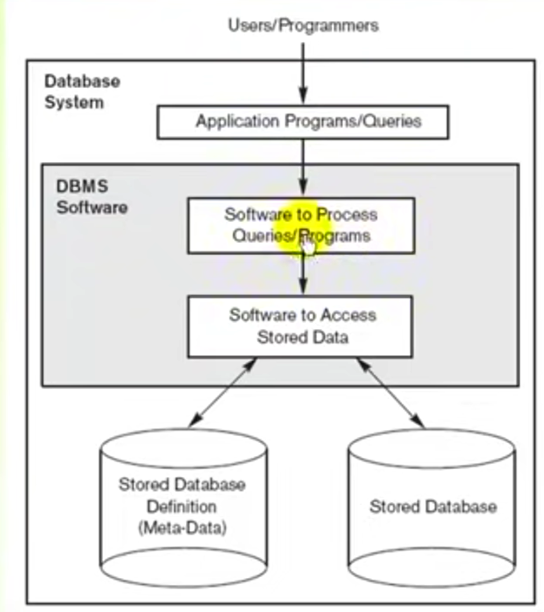
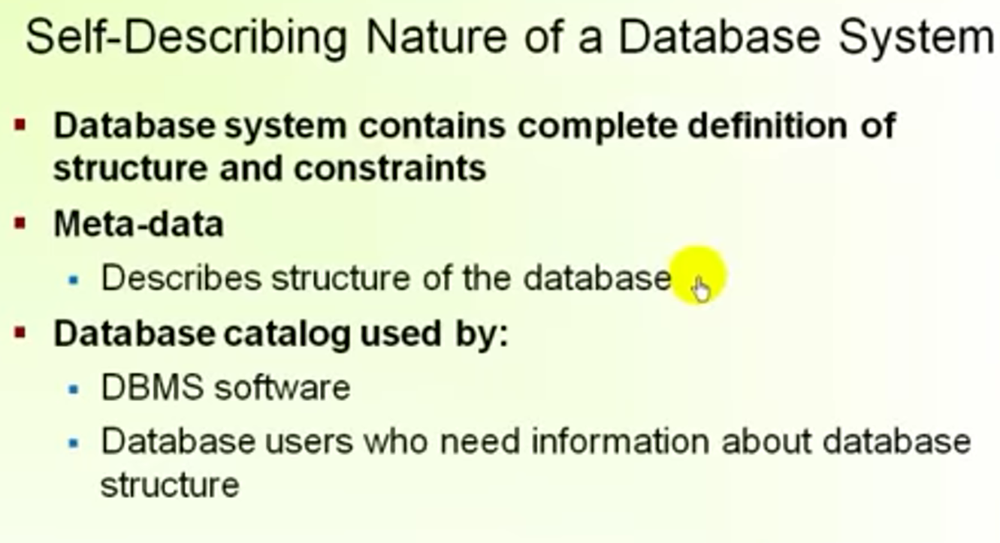
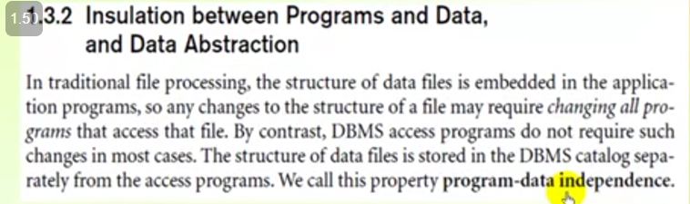
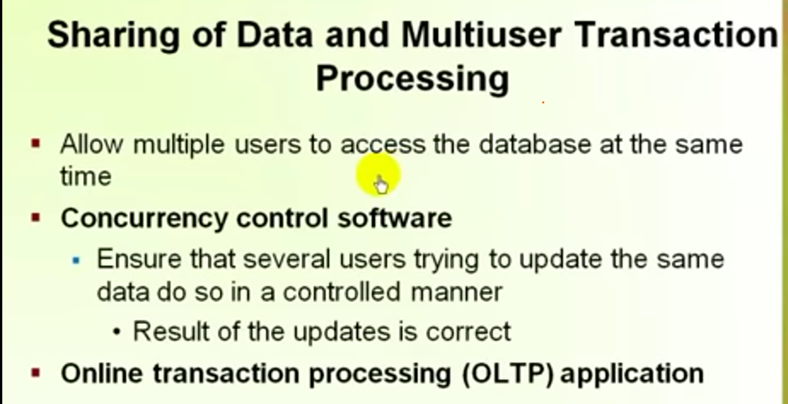
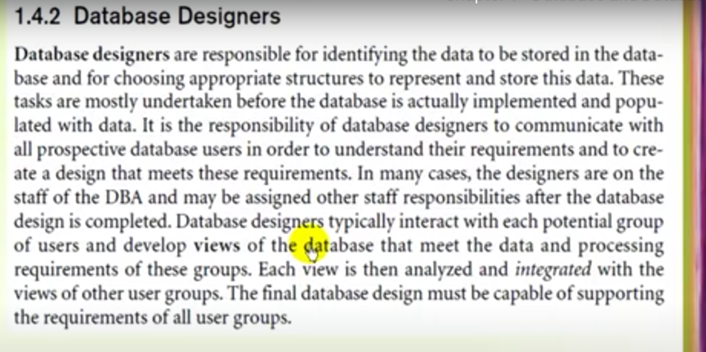
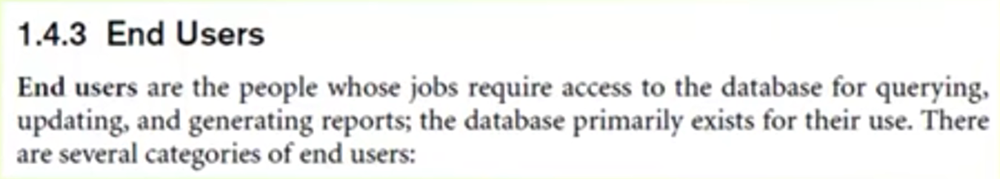
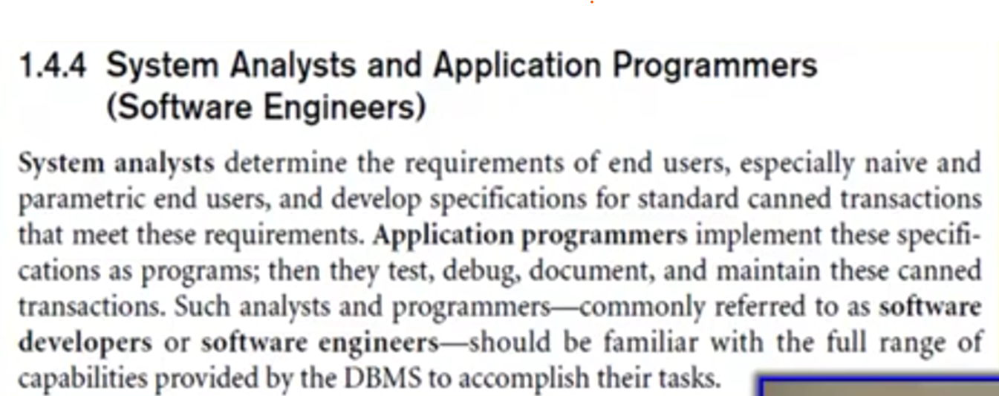

# chapter 1 .. fundamintal of data base systems  (database and database users)
### database: 
is a collection of **related** data , sometimes called **mini wold**, it is designed for specific purpose.
### امثله علي قواعد البيانات
1. traditional db   بتخزن نصوص وارقام
1. multimedia db بتخزن صور وفيديو وصوتيات
1. geographic بتخزن خرايط وتصوير اقمار صناعية
1. data warehouse and online analisis processing :   هي مخزن بنجمع بينات من اكتر من مصدر ونحطها فيها تفيدني في اخذ القرارات
   - extract useful information from very large databases.
___

## database management system:

هو نظام له غرض عام حيث انه يسهل عمليات 1 -تعريف قواعد البيانات او 2-انشائها و3-التعامل معاها وجعلها مشتركه للجميع اي جعل اكتر من مستخدم يوصلو للبينات في نفس الوقت

`1-defining db : `  dayatypes , structures, constrains of the data معرفة

وكل دول بيتخزنو بواسطه dbms في قاموس اسمه meta-data
وهو يعتبر وصف للبيانات اللي بتتخزن في ال db

`2-constructing db :`  the process of sortoring the data.

`3-manuplating db : `       quering (استرجاع البينات)و updating (التعديل البيانات)     -- التعامل مع البيانات 

___

- اي application program بيوصل للdb عن طريق ارسال query ل dbms لاسترجاع الداتا اللي هو عايزها

- اي عملية قراءه او كتابه علي الداتابيز تسمي  **transaction** 
-  DBMS بتوفر :
   - system protection -->from hard or software ...الداتا بتضل زي مهي مبيحصلهاش حاجه 
   - security protection --> from malicious access 
___

## file procsessing ( DB قبل ال  )

DISATVANAGES OF IT:
1. program-Data Dependence
1. Duplication of Data
1. Limited Data Sharing
1. lengthy Development Times
1. Excessive program Maintenance

- اي تعديل في الداتا هيتطلب تعديل في البرنامج كله 
- مكنش فيه sharing(inconsistance) وبالتالي هضطر ان انا انسخ الداتا في كل فايل وطبعا هيأثر علي المساحه وهيخلي مفيش تناسق في البيانات بين كل جهاز
- هياخد وقت طويل في تطويره وفي التعديل عليه

___
## characteristics of database approash :
 ### 1.  الداتا بيز مبتحتوييش فقط علي الداتا لا بيتخزن جواها كمان الdefintion..(وصف الداتا بيز)>>> constrains,structure,data types
 

### 2. في فصل بين البرنامج والداتا يعني اي تعديل علي الداتا مش هيتطلب تعديل علي البرنامج كله ...>program - data independence.
 
   - التجريد او اخفاء التفاصيل عن المستحدم اسمها **data abstraction**  وعشان اعمل كدا بستخدم **data model**
       

### 3. الداتا بيز بتوفر لكل مستخدم البيانات اللي تخصه مش بيشوف كل حاجه يعني
   

### 4. data is shared

___
## Actors on the scene الناس اللي بتاعامل معاها في ال داتابيز 
- `database adminstrator:`
   
- ` Database Designer:`  هو اللي بيحدد الداتا اللي هتتخزن والهيكل بتاعها 
     
- `End user:`
  
- `software engineer` 
- 
  ___
  ___
  ## Advantages of Using DBMS Approash
  1. controlling redunduncy by *normalization*
  2. Restricting access بيوفر امن للبيانات وبيديك صلاحيات معينه تقدر تعملها 
  3. Providing Backup And Recovery System To The Data
  4. Providing Graphicl User Interfaces