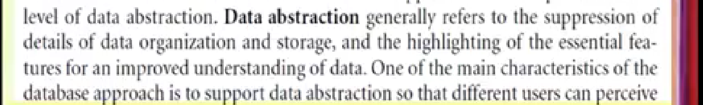
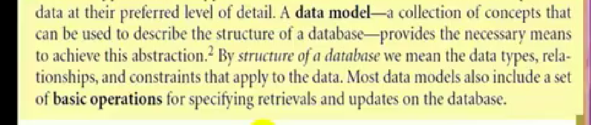
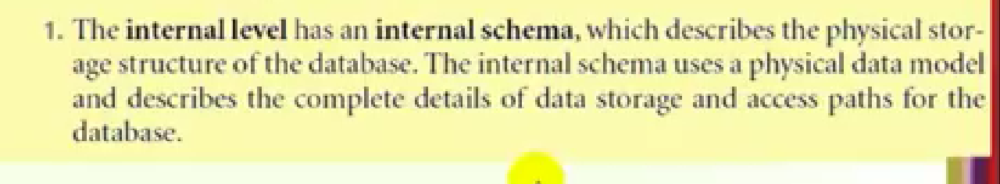
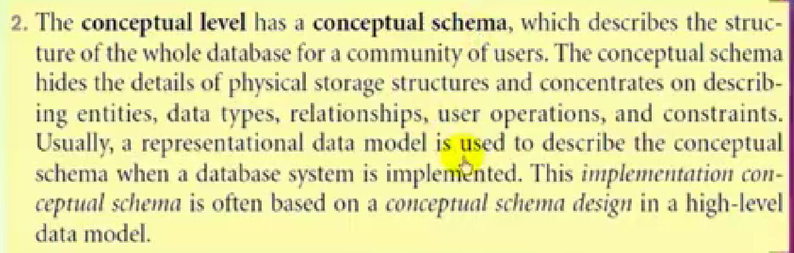
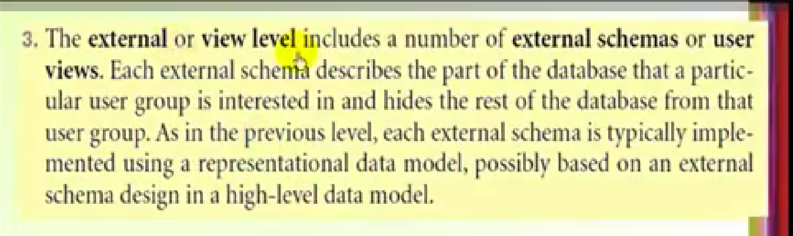
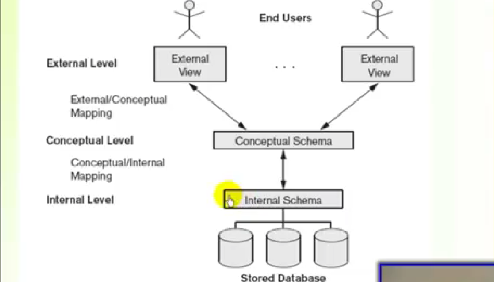
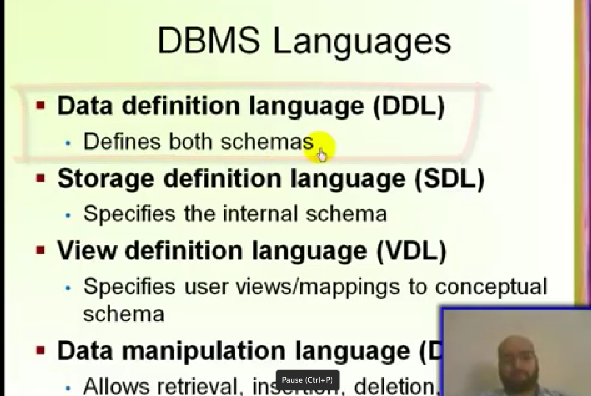
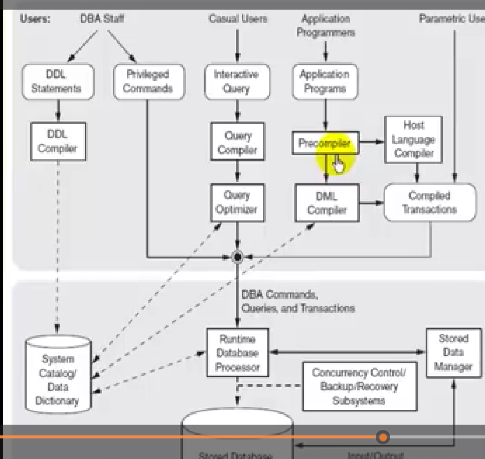
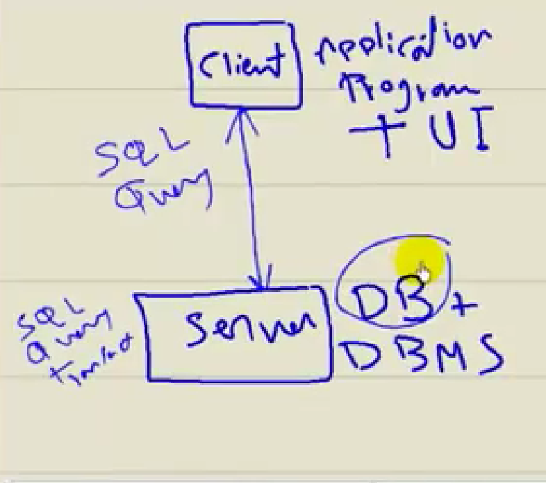
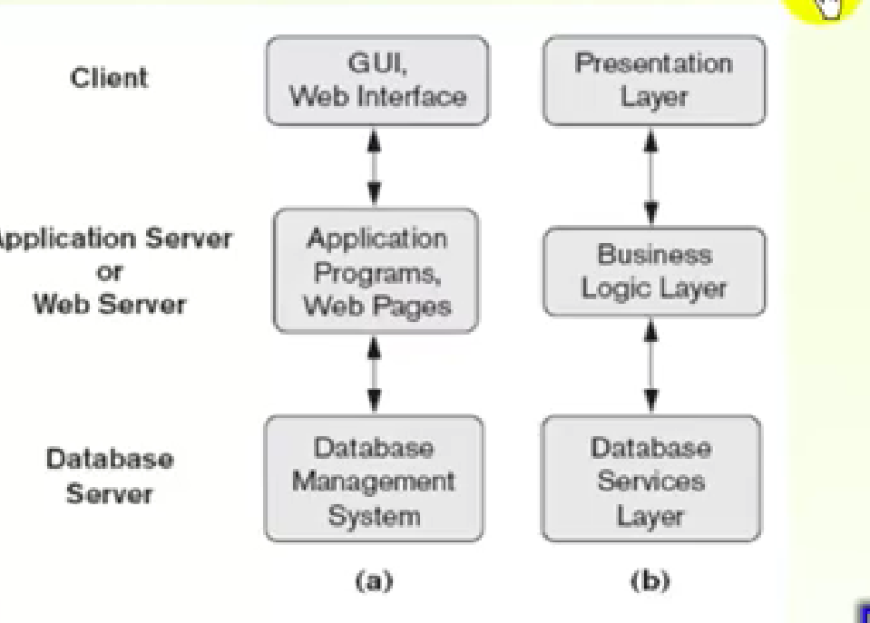

# chapter 2 .. DataBase System Concept And Architechture 
# - Data abstraction :

# - Data Model :

 
# categories (classification) of datamodels:
1. **High level (conceptual):** provides concepts that are close to the way many users precive data,بيخفي التفاصيب عن ال المستخدم 
1. **low level (physical):** provide the concept that describes the detailse of how the data is stored and its access path,it meant for computer specialist not end users.
1. **representational(implementation):** provide the concept that may be easily understood by the end-user , hide many details of data storage...>>الاكثر استخداما في DBMS
   
 `coneptual datamodels use concepts such that:`
-  **entity:** represent real world object such that emplotee,project that is described in the database .الحاجه اللي بخزن معلومات وبيانات عنها في الداتابيز
-  **attripute:** represnts some property that describes an entity..,    البيانات اللي بتوصف واللي عايز اخزنها
-  **relationship:** betwwn 2 or more entities
  
  ___
  **Database Schema:** the description of the database.(data types,constrains,structure)

  **Database state or snapshot or instances or occerances:** the actual data in the database at a practical moment.

  ## THE THREE-SCHEMA ARCHITECTURE:
  the goal of it to separate the user applications(interface) from the physical database ,it can be defined at three levels:
  1. **the internal level:** 
  2. **the conceptual level:**
  3. **the external level:**
   ## the architecture:.
   
   ___
`Data Independence:` changing the schema at one level at database system without having to change the schema at the next higher level.
    - **logival Data Independence:** changing the conceptual schema without having to change the external scheama.
    -  **physical Data Independence:** changing the intrnal schema without having to change the conceptual scheama.
  
     ___

 ## DBMS Language:
 
     ___

## DBMS Environment:  ` هام جدا جدا`
    
___
# Database system utilities ادوات مساعده :
## help DBMS-A to manage the database system and improve performance,the utilisies have many functions such that:
-  **loading:** used to load existing data files like text files into the database
-  **Bachup:** creates backup copy of the database onto tape or other mass storage medium
-  **DB storage reorganization:** used to reorganize set of database fils and creates new access paths 
-  **performance monitoring:** monitors database storage and provides statistics to DBA
___

## 2-tier client server archiitecture for DBMS:

**ODBM open database  connectivity:**software allows clients to call the server

## 3-tier client server archiitecture for DBMS:

- وفرتلي حاجات كتير من اهمها ان اي تعديل هعمله علي الweb program هعمله مره واحده بس عند الweb server بدل معمله الاف المرات عند ال clients

-  مش هحتاج processor عالي عند ال clients عشان عملية ال prosessing بتحصل عند الserver

-  بيديلي درجه من الامن عشان ممكن ا check الصلاحيات والتهديدات واي حاجه عند الwebserver
  
  ___
  ___

