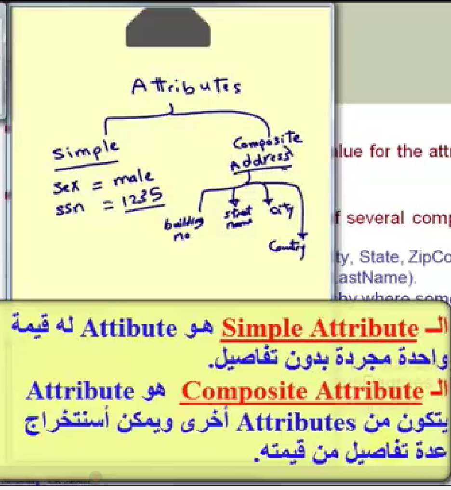

# CH3 kkDataase.. Data Modellind Using The Entity Relationship (ER) model.
### ال ER MODL:
**نموذج يستخدم لتمثيل الكيانات التي نحتفظ عنها ببيانات والعلاقات بينها**

### الEntity:
**هو اي شخص او مكان او حدث او شيئ  يهتم المستخدم يحفظ بياناته في قاعده البيانات**

### الAttributes: 
**هي الخصائص او البياتات التي يتم تخزينها عن كل entity...(name,address,data,email...)**

___
 
## Clssification of attributes:.
- 
- 
- 
- 
- 
- 
  
## How to Draw ER Model
  
`e`:entity `k`:ket attribute `c`: compsite att `m`: multi valued att `d`:derived att
___
## Relationships: 
**degree of realtionships:** refers to the nunber of entities.
- `binary`: between two entities. 
- `ternary`: between three entities.
   
**recusive relationship:**  between the entity and itself.

## constrains on relationships:

- **cardinality of relationships:**

- **participation constrains مشاركه**
  
لو لازم كل الentity تشارك في العلاقه بحط double line ويبقي اسمه total participation

لو مش لازم كل اللي في الentity يشارك بحط single line ويبقي اسمه partial participation

- **(min,max)notation:** 
  
   كل عنصر في الentity يقدر يشارك علي الاقل كام مره وعلي الاكثر كام مره

   ___
  ## Example on ER diagram>>>THE COMPANY
  
  
  
  ## طب ازاي احول الERD الي SCHEMA
1.  بعمل لكل entity جدول
1.  بعمل لكل  multivalued attribute جدول
1.  بعمل لكل علاقه M:N جدول
2.  لكل علاقه  M:1 بنقل ال PKEY من ال 1 الي M
3.  لكل علاقه 1: 1 بنقل ال PKEY من ال partial participation الي ال total participation
   ___
