# ch4 db Enhanced entity - relationship>>محسن

includes all modelling concepts of basic ER diagram+
- superclasses and subclases
- specialization\generlization
- categories(union types)
- inheritance
  
1. **superclasses and subclases**

  in many cases , an entity type has different subgroupings of its entities,each of these subgroups called `subclass` and the main entity called `superclass`

 يعني مثلا الموظف دا entity والموظف دا ممكن يكون محاسب-مهندس-دكتور..كل واحد من دول اسمه subclass

     - يقوم ال subclass بوراثه كل ال attributes وال relationships التي يشترك فيها ال superclass
     - يمكن لل entity من ال superclass ان يكون مشتركا في اكثر من subclass
         - ممكن يكون engineer وفي نفس الوقت salaried emolyee
     - يمكن ل entity من ال superclass ان لا يكون مشتركا في ايا من ال subclasses
     - `local attribute`: attribute of subclass called .

     defining attribute:هي اللي تمت علي اساسها تصنيف ال subclasses

2. 1. **specialization**
   
   is the process of defining subclasses of a superclass.

  ### two main reasons for including subclass and specialization in a data model.
  1. some attributes may apply to some but not all (entities of the superclass)(subclass). a subclass is defined to group the entities  to which these attributes  apply.
   
       زي مثلا engineering department دا attribute يخص المهندسين فقط مش كل ال employees فعشان كدا هاخد المهندسين واحطهم في subclass لوحدهم

  2. some relationship types participated only to group of entities( subclass )
   
  بعض العلاقات مبيشاركش فيها ال entity كلها بيشارك فيها بعض منها بس زي manage مش كل الموظفين بيبقو مديرين ولكن بعض منهم بس     

2. 2. **Generalization**  
   
   is the reverse  of the Specialization.

   بيبقي عندي 2 entities فيها كتير من ال common attribute ف بعمل superclass بحط فيه ال common attributes و بيبقي ال 2 entities نفسهم subclasses وعليهم ال local attributes

   **Example:**
   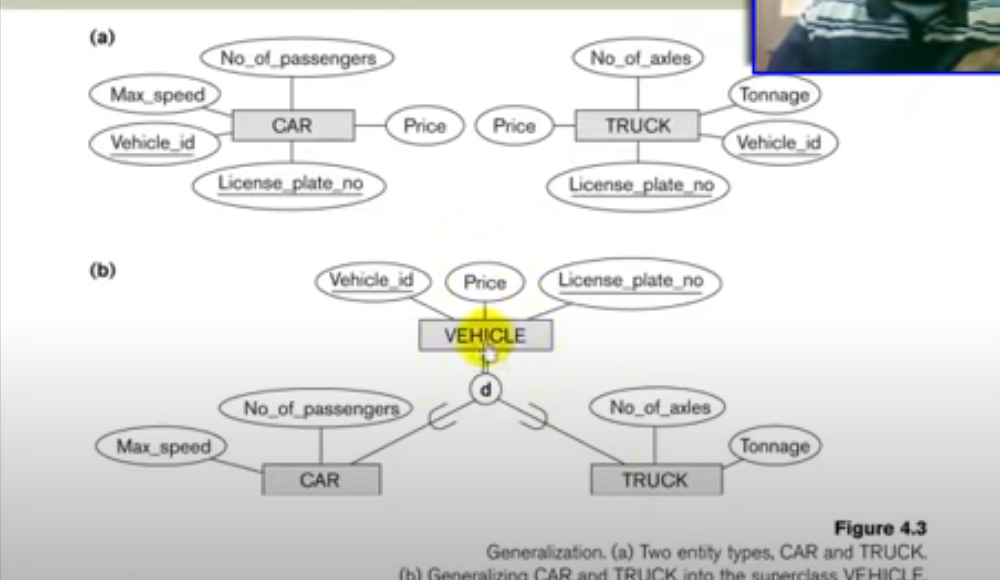
   ___
   **Two Basic Constraints can be apply to a specialization/generalization**

- Disjointness Constraint.
- Completeness Constraint.

1. - disjointness :
    
    means that an entity can be a member of at most one of the subclasses of the specialization.

    يعني ال member في ال superclass لا يصلح الا ان يكون member في subclass واحد فقط (مينفعش يجمع بين اكتر من واحد)

    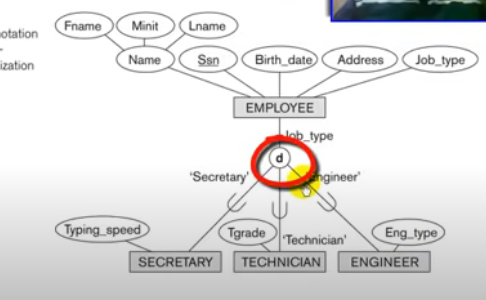

   - overlapping : 
   
   means that the same entity may be a member of more than one subclass of the specialization.

   يعني ال member في ال superclass  يصلح ان يكون member في اكتر من subclass 

   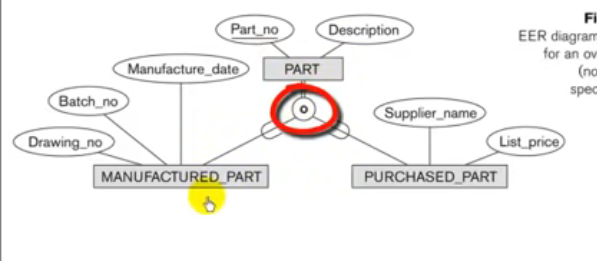

2.    Completeness Constraint:
  
  Total Completeness means that every entity in the superclass must be a member of some subclass in the specialization/generalization  shows by `double line`
  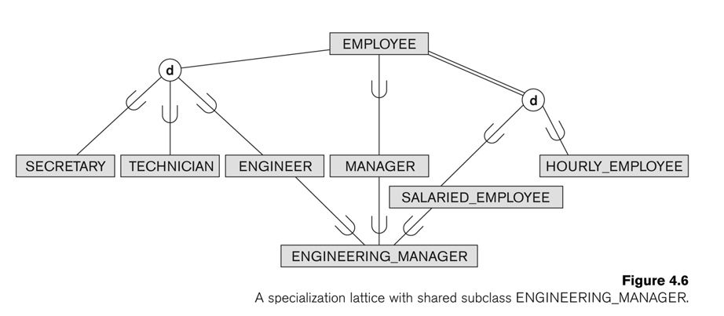

  كل الemployee يا اما salaried يا اما hourly

  انما مش كلهم مهندسين وسكرتاريه وتقنيين في كمان امن ومحاسبين مثلا

  ___
  **Heirarchy:**
  every subclass has only one superclass called `single inheritance`

  **Lattice:**
  subclass has more than one superclass called `multiple inheritance`

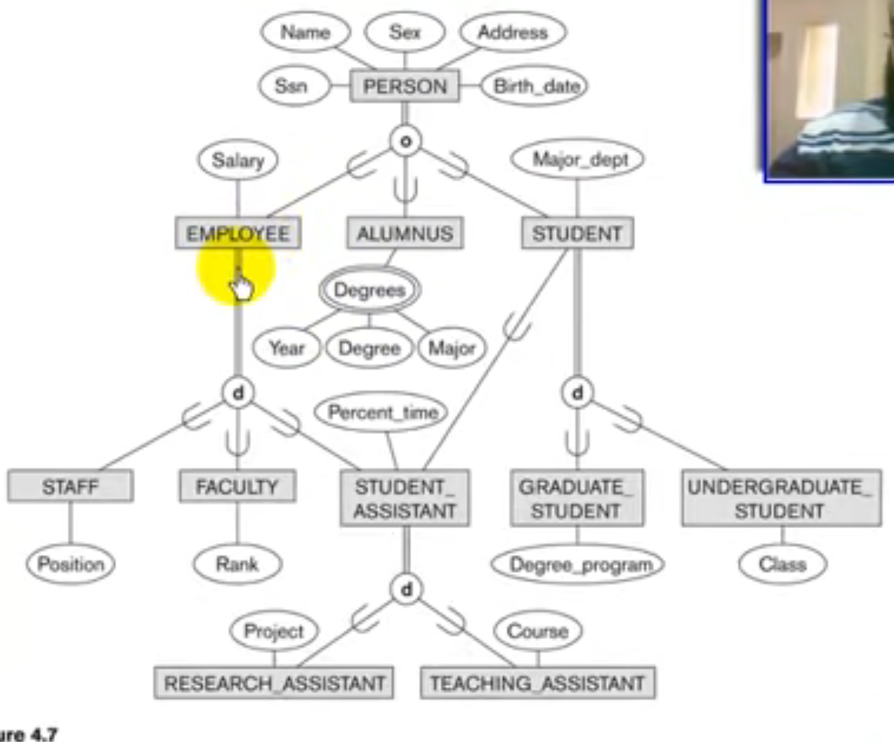
___
#### the main difference between the lattice(shared class) and Union type(category) is:

`shared class:`is the intersection of all his superclasses at the same time

Engineering Manager (Shared class) is a (Intersect) member at all superclass(Engineer-Manager-Salaried Employee) at the same time.

`Union type:` 

هو الاتحاد بتاع ال superclasses بتوعه

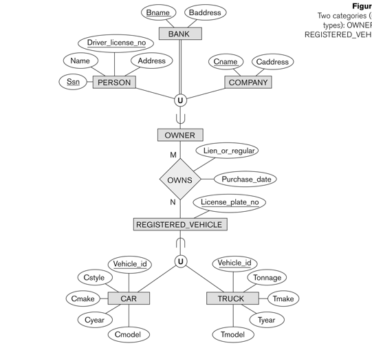

يعني هنا ال owner ممكن يكون company او person او bank 

___
## some examples on the chapter>>>??
 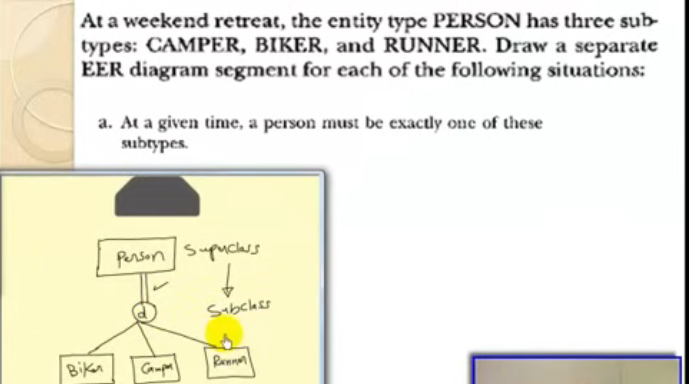 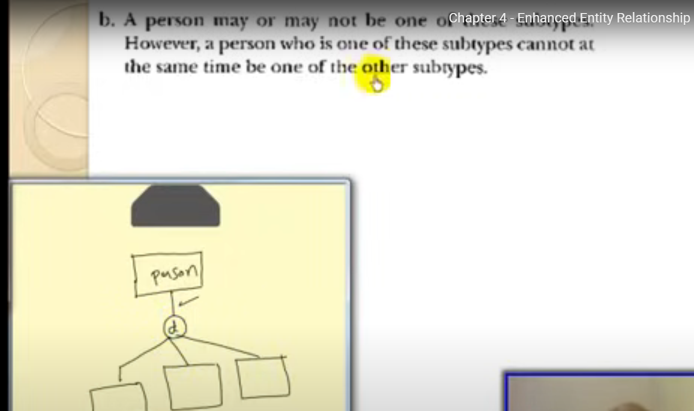 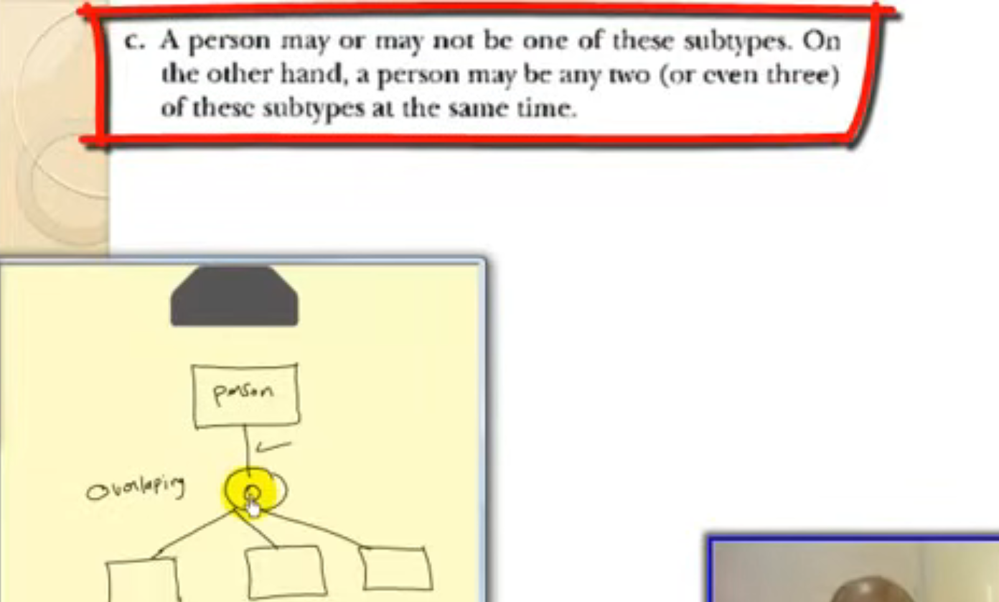 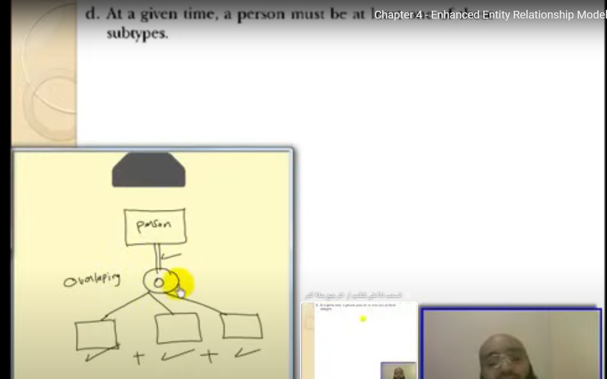 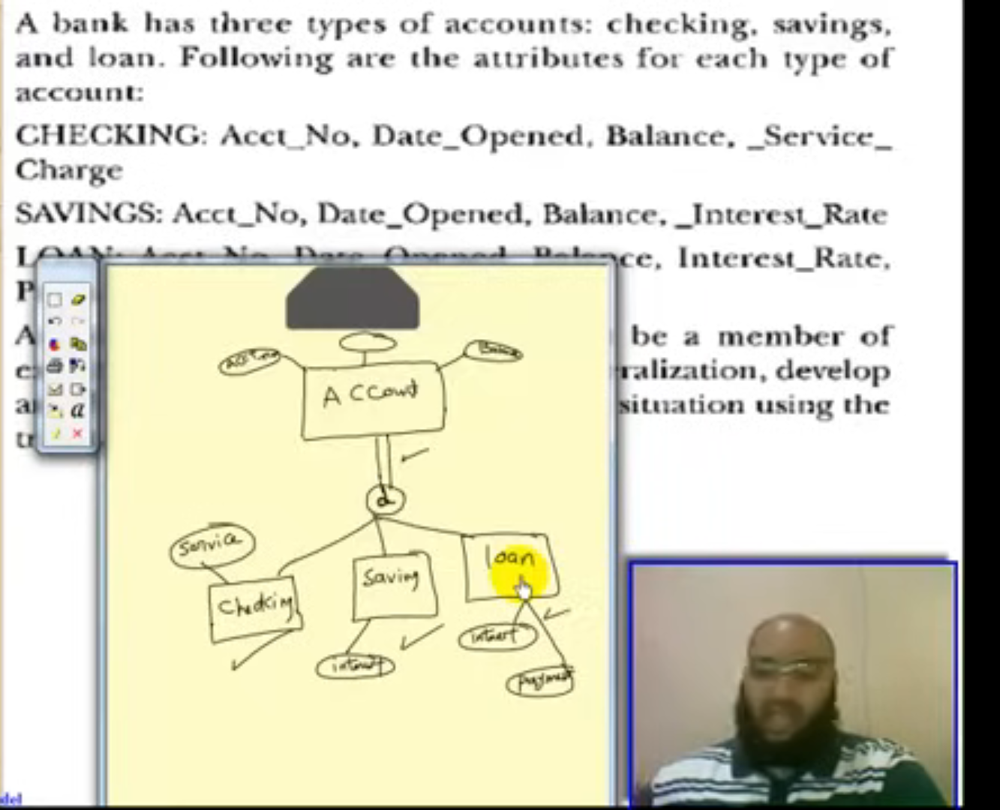 